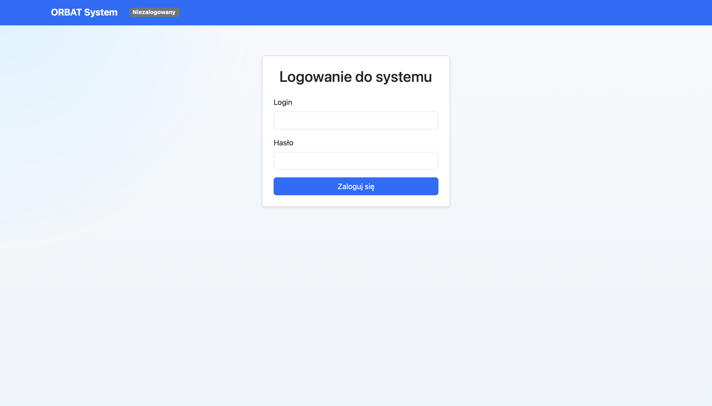
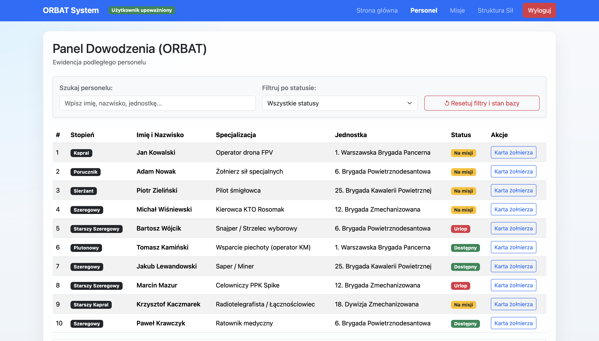
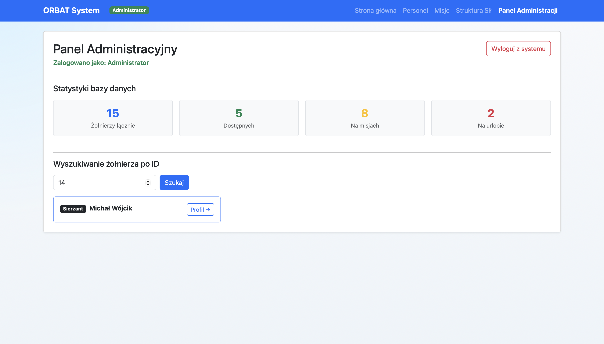
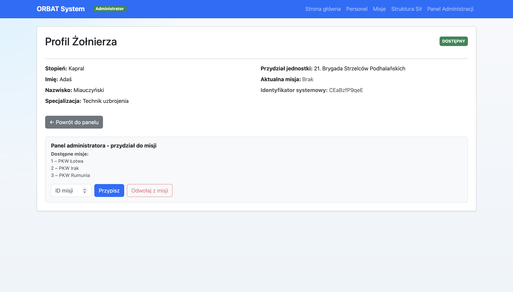
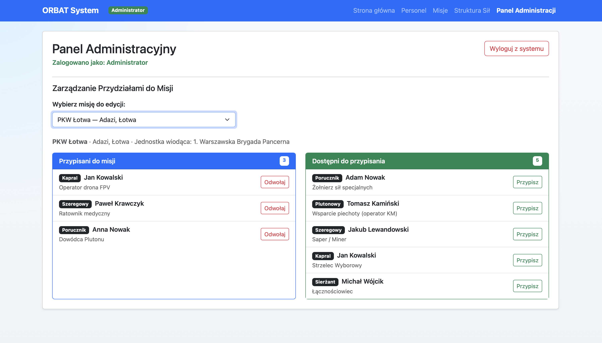
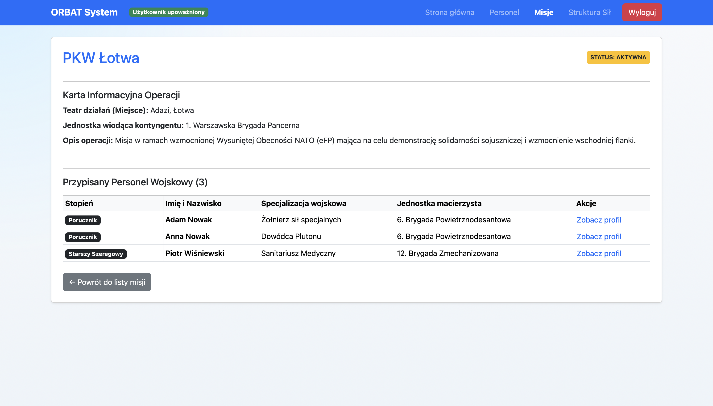

# ORBAT-System-Dashboard

A final project created for the Reactive Programming course.

ORBAT (Order of Battle) System Dashboard is a web-based military command and visualization application designed to present the hierarchical structure and organization of armed forces. The system demonstrates role-based access control, unit management, and real-time dashboard concepts in a modern reactive web application.

«This project is intended solely for educational purposes. It is not affiliated with any military organization, government agency, or commercial entity.»


# Screenshots

Login Screen



User Dashboard



Administration Panel



Other Screenshots








---

Demo Credentials

| Role | Username    | Password    |
| :---:   | :---: | :---: |
| User | "user" | "user" |
| Administrator | "admin" | "admin" |

---

Features

- Military Order of Battle (ORBAT) visualization
- Hierarchical force structure presentation
- User and administrator roles
- Administrative management panel
- Reactive frontend architecture
- REST API communication
- Educational demonstration of access control and dashboard design

---

Running the Application

From the project root directory:

```bash
npm start
```

The command starts both the frontend and backend services.

Default Ports

| Service | Port |
| :---:   | :---: |
| Frontend Application | 5173 |
| Backend Server/API | 5000 |

After startup, open:

`http://localhost:5173`

---

Disclaimer

*This software is a university project created for educational and demonstration purposes only. Any military symbols, terminology, or organizational structures presented in the application are used exclusively for academic learning and software engineering practice.*
